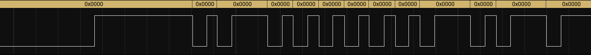
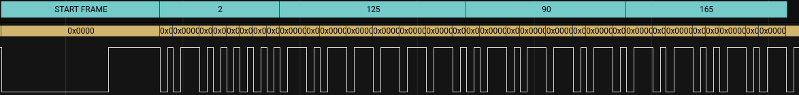

  # NEC Decoder
  
This is an Extension for the Saleae Logic 2 software for Saleae Logic Analyzers. This decodes signals in the NEC format, which is (almost) exclusively used for infrared remote controls for TV's, DVD players, and similar hardware.

To use this, you'll need to install it to your instance of Logic 2. Then, capture a signal from your remote. Next, go to Analyzers, and add a new analyzer of the Simple Parallel variety. This is a serial signal, but using the Parallel was the best way I could find to get frames that correspond to individual bits. Select the channel to analyze, and then go down to Clock and select the same signal line. Finally, set your clock state depending on the nature of your signal - if it's high at rest, pick falling edge. If low at rest, pick rising edge. Note: I have only tested this with Falling edge as that's the variety of IR sensor I have.

Once you apply this analyzer, you should now have each of your bits segmented out, like in the image below:

Now, with that foundational analyzer in place, we can apply the NEC decoder. Add a second analyzer of the NEC Decoder type. For your input analyzer, select the Simple Parallel that we just placed. That should give you something a little like my example here of a captured data frame:

For documentation of the signal format, I used this page pretty heavily: https://techdocs.altium.com/display/FPGA/NEC+Infrared+Transmission+Protocol

# Please note that this is my first time making a Saleae extension and it could very well have many mistakes in it, of any number of varieties. I would love to hear any feedback anyone may have, especially folks from Saleae!
